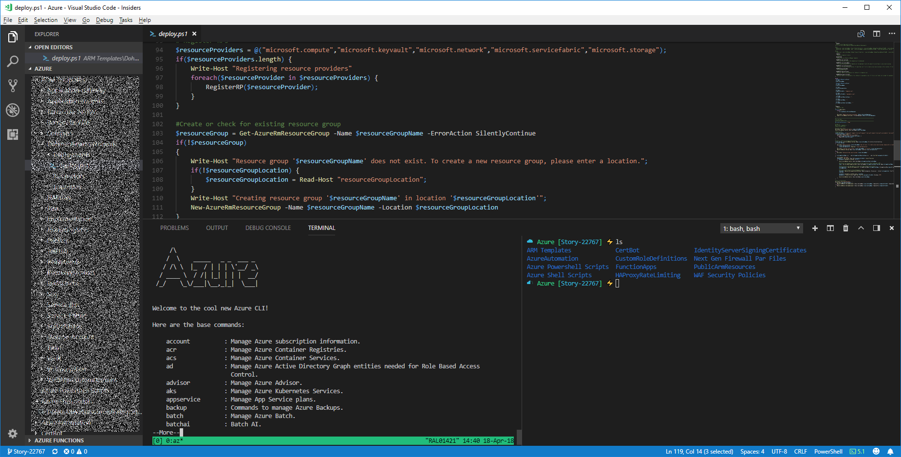

# wsl-azure-bash-terminal
Inspired by the terminal that Jessical Dean configured, I put my own spin on it. Similar to hers but more geared towards the things that I'm currently using.


# My Environment

## Applications Installed
- zsh
  - zshell
- git
  - If you are reading this, you know what this is.
- bash-completion
  - Tab completion is a nice thing
- oh-my-zsh
  - Where the z shell magic happens
- zsh completions, autosuggestions, and syntax highlighting
  - More zsh magic
- powerlevel9k
  - Not required but something that I like to use every now and again. 
- vim color scheme install
  - Yes, sometimes in vsCode I will use vim at the same time. Old habits die hard.
- jq
  - This sed for json
- pip
  - Python package manager and used to installed speedtest-cli
- tmux
  - Terminal multiplexer used to be able to have multiple terminal sessions running under one main session
- speedtest-cli
  - Because my network at work is less that happy sometimes and I like to check this without leaving the terminal window
- az-cli
  - One of the key reasons why I decided to put this together in the first place.

## Process

### Pre-reqs
#### Windows:
- Windows 10 Fall Creators Edition
- Ubuntu installed (https://docs.microsoft.com/en-us/windows/wsl/install-on-server)

#### Mac:
- Untested

### Install
Start Bash and run the followiong
```
sh -c "$(curl -fsSL https://raw.githubusercontent.com/jerry-locke/wsl-azure-bash-terminal/master/vsCodeTermConfig.sh)"
```

### Post Install Config

Edit your ~/.zshrc file and set your theme to whatever one you want (e.g. I use this: ZSH_THEME=cloud)

To see a list of themes:
```
ls ~/.oh-my-zsh/themes
```

### Start zsh
Type *zsh* and press enter to start your zsh session if it's not your default shell.

### Troubleshooting
If you are not able to see the proper icons in vsCode - you might need to fix your registry HKCU:\Console settings. Clearing that resolved the issue for me, but you might have settings in there that you want to keep, so make sure you know what you want to remove and keep a backup of your registry / registry key before making any changes.
